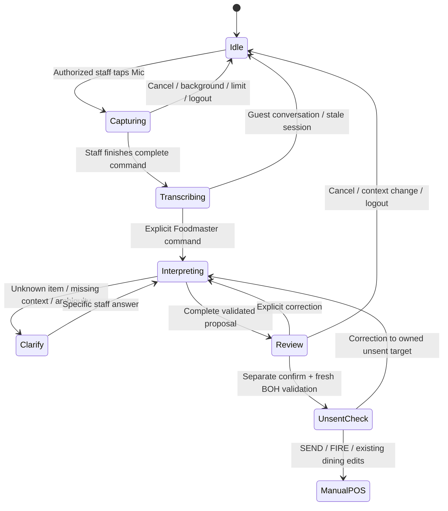

# Epicurean POS Build 67: evidence, repair and validation

Review branch: `voice/build67-reliability-audit`. Baseline: `cfeceb8b211b334e4dc080f2dbed82c8c0e4e27f`. No deployment, push, production API calls, live restaurant writes, or dependency/lockfile changes were made. The implementation below is a review prototype, not an iPhone acceptance claim.

## 1. Diagnosis from actual code

The user's controlled utterance was approximately: “Position 2, appetizer pescatore, main course pork chop medium. Confirm.” The actual dishes are `sf_p_linguini` (Linguini in spicy pescatore sauce) and `sf_m_pork` (14 oz. roasted pork chop “San Domenico”). The screen reported `unparsed: position 2appetizer`, `no à la carte price · Medium`, and `NO_MATCH` for “No, change what you wrote.” There is no complete original ASR transcript or recording. Those missing observations limit attribution of the physical incident.

| Finding | Code evidence in Build 67 | Reproduction / significance |
| --- | --- | --- |
| Joined seat/course text is not recognized as a position | `voice-service.js: readPositions`, `splitClauses`; `index.html: voicePositionPhrase`, `voicePhraseBody` depend on word/whitespace boundaries | `voiceResolveVocab('position 2appetizer pescatore')` reproduces **exactly** `unparsed: position 2appetizer`. The parser can fail on this input; there is no evidence establishing whether Deepgram or another boundary produced it during the phone test. |
| No standalone price is an intentional safeguard, not a missing keyword | `index.html: voiceResolveVocab`, `voiceCanPrice`, `voiceProjectDish`; `scalini-dining.js: sf_p_linguini, sf_m_pork` | With the real bundled prix-fixe definitions and no dining basis, `voiceResolveVocab('pork chop medium')` reproduces **exactly** `no à la carte price · Medium`. It recognizes dish and temperature but cannot legitimately price a standalone plate. A robotic readback does not prove a check line exists. |
| A sentence can produce a partial order/readback | `index.html: voiceRunBatch` executes each clause through `applyVoiceCommand`, then summarizes added lines and drafts. Inline “confirm” accepts successful clauses even if other clauses failed. Non-confirm batches also briefly construct/persist lines before taking them off the check. `voiceCommitBatch` pushes held copies without revalidating current BOH/context. | The immutable baseline reproduction with priced fixture records adds only pork for a raviolo/pork two-course sentence and leaves the appetizer unresolved. Thus partial completion is demonstrated independently of the user's missing raw transcript. |
| Full dish names can fail even when their keyword matches | `voice-catalog.js: resolveEntries` retains the longest matching keyword and leftovers; `index.html: voiceResolveVocab` uses name matching only when keyword resolution returns `none`; then unknown leftovers become drafts | “soft egg yolk raviolo” matches `RAVIOLO` but rejects `soft egg yolk`, which belongs to the BOH display name. This additional defect is reproduced; it is not presented as the cause of the Pescatore incident. |
| Corrections are grammar fragments, not context-aware dialogue | `voice-turn.js: correctionCue` accepts “instead/change that/make it/rather/switch”; `decide` additionally needs a recognized item. `voice-service.js: classify` only treats certain negated positions as corrections. `lineForSeat` chooses the last line for a seat. | “No, change what you wrote” lacks both an understood correction act and a specific replacement/target. It falls through to a `NO_MATCH` draft. A safe system must ask what to change, without changing or duplicating anything. A specific natural temperature correction is also rejected in the baseline reproduction. |
| Logout is not a voice-session boundary | Baseline `index.html: logout` clears `currentServer` and changes screen, but does not stop capture, invalidate requests, reset pending turn/batch, release audio resources, or cancel TTS | Baseline reproduction starts a delayed transcription, logs out, and then releases its result. `voiceSession.on` remains true and `applyVoiceCommand` runs after logout. This is a proven lifecycle defect; the precise iPhone “nothing happened” sequence remains unconfirmed. |
| Recorder callbacks can operate on the wrong recording | Baseline `startVoiceClip` registers `rec.onstop=function(){ finishVoiceClip(); }`; `finishVoiceClip` reads global `STATE._voiceRec` | Delayed callbacks are not bound to their own recorder. Cancellation and a subsequent recording can overlap. Clip `_voiceToken` checks cover some results but logout fails to invalidate them when transcription is already in flight. |
| Recording can cut a multi-course request into fragments | Baseline `voiceWatchSpeech` ends a clip after 900 ms quiet, or 4 seconds without detected speech. `startVoiceClip` stops at 8 seconds; `voiceSpeak` suppresses/stops capture during readback | These are concrete capture policies, not proof of what the iPhone audio contained. Mid-order pauses, long utterances, quiet voices, restaurant noise and TTS can create incomplete clips. Adding an LLM cannot recover audio that was never captured. |
| Tests did not reproduce the physical workflow | `test/voice-engine.mjs` uses a fake recorder returning a `{size:32}` object and canned transcript; temporarily replaces `applyVoiceCommand` with a spy. Other suites inline selected scripts in jsdom and directly invoke parser/POS functions. | Passing tests prove some parser and application contracts, not Safari audio, complete turn capture, real ASR, auth refresh or logout/relogin recovery. The earlier onboarding's passing tests were not evidence that voice worked on an iPhone. |

Other relevant limits: `postVoiceClip` previously collapsed HTTP failures to “transcribe”; `voicePcmBlob` uses nearest-neighbor downsampling without an antialiasing filter; `AudioContext.resume()` was not awaited; `voiceKeywordHints` supplies keyword keys rather than the whole BOH naming context; Deepgram is called with `punctuate=false` and `smart_format=false` (`server/voice-transcribe.mjs: deepgramListenUrl`). These are audit findings and test targets, not asserted causes of the observed speech errors. The endpoint accepts a Firebase token for the project (`functions/index.js: verifyProjectToken` checks audience); it does not by itself authorize a Foodmaster/staff role. Client staff PIN state is not server authorization.

## 2. Recommendation and smallest viable repair

**Retain Deepgram for transcription; add a bounded, server-side text interpretation layer after stabilizing capture and order state. Do not migrate to a realtime conversational voice API to fix these failures.**

The proven failures are predominantly incomplete capture boundaries, brittle interpretation, an absent transaction/proposal model, missing pricing context and broken lifecycle ownership. Realtime speech models still need every one of those safeguards. They also introduce WebRTC/session renewal, turn endpointing and barge-in behavior on iPhone. Their value would be continuous low-latency dialogue, not automatic correctness. Run a comparative pilot later if hands-free conversation becomes a product requirement; use the same validator and mutation API regardless of speech provider.

The review implementation makes the following repair concrete:

- `voice-order.js`: bounded proposal coordinator, duplicate event protection, context/generation fencing, clarification, cancellation, explicit separate confirmation, and replacement of proposal items rather than adding another item. A combined utterance does not silently confirm itself.
- `voice-order-bridge.js`: only speech beginning with **Foodmaster** enters the mutation workflow. Seat/course words inside guest conversation do not authorize an order. A wake phrase is an explicit protocol, not speaker authentication or diarization; microphone use still requires an authorized staff user. Every field from an optional model is untrusted.
- The bridge normalizes the demonstrated `position 2appetizer` boundary, matches full names against BOH, stages all requested courses, asks a targeted question on “No, change what you wrote,” and supports specific appetizer replacement and allowed temperature corrections.
- Every confirmation rechecks the current published BOH vocabulary, source ID, availability/86, valid required modifiers, allergy conflicts, course, existing seat identity, current table/check/server and pricing basis. Prices are excluded from interpretation output. `2` and `2A` cannot silently substitute for one another, and voice does not add guests or rewrite priority identity.
- The **VOICE PRICING BASIS** selector requires an explicit menu choice for unpriced prix-fixe dishes. Without it, no free plate or arbitrary extra-plate charge is created. With the current Scalini menu selected, the bridge delegates to the unchanged `openPrixFixeSelector`/`confirmPrixFixe` constructors and their BOH prices/upcharges. It adds the included appetizer/main as one unsent menu line. Both choices are required; an existing menu on the seat blocks duplication.
- Standalone priced-item confirmation delegates to existing POS construction/pricing in a synchronous local transaction. All lines are prepared before a single check update. Corrections to an owned unsent standalone line preserve its `lineId` and held/ticket state. Manual lines, sent lines and other checks are not correction targets.
- Capture is now tap-to-record, tap **Finish command**. A 30-second limit rejects the recording and asks for a shorter command; it does not interpret a truncated prefix. The previous 900 ms pause and eight-second cutoff are not used by the new path. No passive restart between commands. Guest audio may still be present during an explicitly recorded clip; `VOICE_GUEST_RECORDING=false` did not make that physically impossible.
- `index.html`: logout/login/table changes fence old work; callbacks carry the original recorder, table, check and staff identity; cancellation immediately detaches the old recorder; pending permission/recovery results are fenced; tracks, analyser connections, AudioContext and TTS are released. A late HTTP or interpreter result cannot survive logout. HTTP requests have a timeout and display auth/transcription failures. The last heard transcript is visible locally and cleared at logout; no raw guest audio retention or diagnostic upload was added.
- `functions/interpret-order.mjs`: optional server-only OpenAI Responses adapter with strict structured output, bounded input/output, timeout, no price fields and no writing capability. A transport contract test runs against controlled HTTP responses. The adapter is **not registered as an endpoint, connected to the browser or tested with a live model**. The default demonstration uses deterministic interpretation; the browser can accept an injected interpreter through the same BOH validator. Before enabling the adapter, add verified staff authorization, server-loaded BOH/context, rate limits, request IDs and audit events. Do not expose provider credentials to Safari or trust client-supplied catalog snapshots.

Thirteen manual POS/pricing/SEND/FIRE/catalog functions were compared byte-for-byte with Build 67 and are unchanged. BOH sources, pricing data and lockfiles are unchanged. Voice adds **unsent** work only: SEND, FIRE and payment remain manual.

### Ordering state machine and data contract



A proposal carries `proposalId`, action, source item ID, exact seat identity, course, allowed modifier values, notes and an explicit replacement target. It never carries a price. A command event is fenced by session generation, check ID, table, staff identity and catalog/pricing context; confirm additionally checks current availability and actual line ownership. Keep the whole proposed turn, unresolved slots and its revision rather than only a single “last dish.” A correction with no unique target becomes a question; it does not pick the latest line for a seat.

The explicit-command gate stays ahead of the LLM. Within an active correction, an eventual conversational interpreter should fill missing target/replacement slots, return only bounded operations and request clarification when uncertain. Unresolved course requests must block the whole confirmation. Clarification answers in this prototype also require Foodmaster; confirmation can use the on-screen button.

For a production pilot, persist command receipts/idempotency keys and expected check/catalog revisions in an authorized server transaction; preserve identity across retries and enforce ownership/status there. This prototype's atomicity is **local**, using the existing manual POS persistence semantics. It does not establish multi-client Firestore atomicity, offline durability or conflict resolution. A reload discards unconfirmed proposals; persisted unsent manual checks remain governed by existing POS code.

### Deliberate prototype limits

Included prix-fixe appetizer/main choices and pre-confirmation substitutions are demonstrated. Editing an already-created prix-fixe/tasting course, dessert choice/scoops, arbitrary dining notes, quantity changes, allergy overrides, seat moves, cancellation of a sent dish and cocktail/wine price quotation remain manual. The bridge refuses these unsupported operations instead of inferring a price or mutating a fired course. An existing standalone item priced by BOH can be corrected after confirmation; an existing prix-fixe line cannot yet be corrected by voice. A production interpreter must support dining-course targets with parent menu ID, course ID, selected option ID, fired flag and owning check revision before adding that capability.

## 3. Working automated evidence

Reproduce from `/workspace/epicurean-pos` using Node 22:

```bash
export PATH=/workspace/setup-tools/node_modules/.bin:$PATH
node test/voice-build67-reproduce.cjs
node test/voice-reliability-browser.cjs
node test/voice-interpret-provider.mjs
```

The browser harness requires Playwright and Chromium, which are already supplied by this cloud runtime; `CHROMIUM_PATH` can override its Chromium executable. The package-based POS tests require the installed `test/` dependencies.

The baseline script reads files from the immutable Build 67 SHA, not the repaired files. It asserts the exact `position 2appetizer` and missing-price errors; additionally demonstrates a partial multi-course commit, rejected temperature correction, and processing of a delayed transcript after logout. Its fixtures are controlled test data, not an assertion that their transcript is the missing iPhone transcript.

The browser demonstration uses **actual headless Chromium, getUserMedia with its synthetic test device, MediaRecorder, AudioContext/WAV conversion, real HTTP multipart transport, and the actual voice handler/transcription module**. Firebase token verification and Deepgram's response are injected test doubles. Non-local requests are blocked. Recorded audio is synthetic, not spoken test language. This checks the media/container/HTTP/order integration; it does not test Deepgram recognition quality.

Observed outcomes:

1. Guest conversation mentioning a seat causes no order change.
2. Three priced fixture courses (appetizer, main Medium, dessert) stay outside the check until confirmation. An appetizer substitution replaces its proposal entry; confirmation creates exactly three correctly seated unsent lines at fixture BOH prices.
3. A subsequent temperature correction preserves the main line ID and line count. Duplicate event delivery produces no duplicate lines.
4. Logout during pending transcription stops the old session, discards the result and preserves the check. Login, fresh recording and a new order work.
5. An 86 change between review and confirmation blocks the complete commit. An injected model price field is rejected. A partly valid multi-course request creates neither partial proposals nor partial check lines. Manual lines cannot be targeted. A pending model response is also discarded at logout.
6. The user's exact Pescatore/pork dishes with their authentic zero standalone prices fail safely in à-la-carte mode. After explicit selection of the existing `pf_scalini_89` menu, the joined seat/course variant is parsed into two proposals. “No, change what you wrote” preserves both and asks a question. An explicit appetizer substitution then confirms through manual prix-fixe code: **one $89 menu line**, Porcini appetizer, pork Medium, seat **2**, included courses, no added extra-plate charge.
7. No voice SEND or FIRE occurs. Four earlier standalone fixture lines remain intact while the new prix-fixe line is added on another check.

The latest browser run made 17 actual audio HTTP requests and finished with five unsent check lines, including one $89 prix-fixe menu. All 15 existing POS `.mjs` scripts passed; the added provider-contract script, immutable baseline reproduction and browser demonstration also passed. The BOH repository's six existing scripts passed during onboarding; that repository was not changed by this task. The legacy coverage report is redirected to a writable local directory with the pre-existing setup helper; no assertions are disabled.

Result artifacts are retained in `docs/voice-build67-baseline-results.json` and `docs/voice-build67-browser-results.json`. The provider contract test covers schema/response handling, unknown item rejection, provider 429 and incomplete results using controlled responses. It establishes no live model accuracy or provider connectivity.

## 4. Remaining physical iPhone acceptance

Use an isolated test Firebase project/menu and test staff account. Never test corrections against live guest checks. Start with the exact utterance, explicitly selecting the applicable BOH pricing menu and establishing seat 2 first:

> Tap Mic. “Foodmaster, position 2, appetizer pescatore, main course pork chop medium.” Tap Finish command. Inspect both proposals. “Foodmaster confirm.”

Then “Foodmaster, no, change what you wrote” must ask for clarification, followed by a specific replacement. To reproduce the original problem, capture redacted diagnostics of raw transcript, recording duration/bytes/MIME, request/clip/session IDs, HTTP status, interpretation operations/reasons and the check before/after. Consent is required if retaining controlled audio; do not retain guest conversation by default or log staff PINs, tokens or provider keys.

| Physical check | Required result |
| --- | --- |
| Current iPhone Safari on at least two device/iOS generations; actual MediaRecorder MP4/AAC and WAV fallback | Intelligible full audio, correct MIME, both requested dishes and temperature; manually compare transcript with controlled source utterance. Chromium's synthetic device cannot prove this. |
| Exact Pescatore + pork Medium; pauses of 0.5–2 seconds; long names, accents and restaurant/background speech | Complete proposal or explicit clarification. Never “confirmed” after silently dropping a dish. Guest speech never becomes a check line. |
| Vague correction, targeted substitution, valid/invalid temperature, multiple same-course dishes/seats, 2 vs 2A | A unique validated replacement or a specific question; stable target identity; no duplicate/seat drift. Existing prix-fixe course edits stay manual in this prototype. |
| Twenty successive logout/login/record/order cycles; logout during permission prompt, capture, HTTP, interpretation and TTS | Tracks released, no old-context writes, fresh permission/capture succeeds, no silent stuck recorder/AudioContext. This is still a required acceptance gate. |
| Screen lock, background/foreground, incoming call, permission denial/re-enable, Bluetooth/headset route changes | Explicit interrupted state; staff gesture resumes fresh capture. No partial audio interpreted as a complete order. |
| TTS output and echo with device speaker volume varied | Readback cannot become another command, block the next turn or truncate an ongoing order. The current browser harness disables audible TTS. |
| Expired/revoked Firebase token, anonymous-auth restriction, weak Wi-Fi, offline, server 401/429/5xx, request timeout | Visible failure, no check mutation or duplicate retry; successful recovery with refreshed authorized session. |
| BOH revision/86/price/modifier changes during review; table/check switch and concurrent manual edits | Fresh validation blocks stale/invalid commits; manual and sent work unchanged. Test real Firebase conflict behavior separately from the local transaction. |
| Existing working manual POS, menu/upcharges, included courses, allergy gates, unsent/held/sent behavior and manual SEND/FIRE | No regressions. Confirming voice alone never sends or fires. |

Target acceptance for a controlled pilot: every unsafe/ambiguous case has zero unintended check writes; every complete command either commits the entire validated proposal or visibly requests clarification. Measure intent accuracy, course omission, correction success, time to confirmation and recovery across real utterances—not just catalog coverage percentages. A suggested pilot corpus is 50 distinct scenarios across both devices, plus the 20 restart cycles per device; repeat failures after repair. Do not claim statistical error rates from that small pilot.

## 5. Provider costs and engineering effort

These are **planning estimates**, not current quotations. Attempts to fetch the official Deepgram and OpenAI pricing pages returned network-proxy 403, so current rates, regional availability, retention settings, endpoint model support and account-specific terms were not independently verified. Check [Deepgram pricing](https://deepgram.com/pricing) and [OpenAI API pricing](https://openai.com/api/pricing/) before choosing a paid pilot.

| Option / assumption | Illustrative cost for 10,000 order interactions |
| --- | --- |
| Retained Deepgram, assumed $0.005–$0.010 per audio minute; 40 seconds of uploaded speech per interaction including confirmation/correction | 6,667 audio minutes: **$33–$67** STT |
| Text interpreter at an illustrative GPT-4.1-mini rate of $0.40/M input and $1.60/M output tokens; three calls per interaction, 2,000 input + 200 output tokens each | 60M input + 6M output tokens: **$33.60** |
| Recommended combined pipeline under those assumptions | **About $67–$100 / 10,000 interactions**, or $0.007–$0.010 each, before Firebase/functions/network and retries |
| Realtime reference scenario: 90 seconds of billable input speech and 10 seconds of output speech per interaction; audio input 600 tokens/minute, output 1,200 tokens/minute; illustrative full-model prices $32/M input and $64/M output | Input $288 + output $128: **about $416 / 10,000**, plus text context, backend/network and retries |
| Same audio-token scenario at illustrative mini-model prices $10/M input and $20/M output | **About $130 / 10,000**, plus text context/backend costs; suitability/accuracy requires a pilot |

The realtime figures use explicit speech-token assumptions, not elapsed connection minutes, and are not an apples-to-apples quality or latency comparison. Actual provider tokenization, silence handling, output verbosity and context reuse affect billing. Prompting with the entire wine cellar is neither necessary nor included in the text estimate: send a current bounded restaurant/course candidate set plus active turn context. Price and availability checks remain deterministic. Avoid provider TTS initially; the existing local readback has no per-token API bill but still needs iPhone testing.

Estimated senior engineering effort for a production pilot of the retained-STT design:

| Work | Hours |
| --- | ---: |
| Capture/lifecycle fencing, Safari recovery and diagnostic events | 12–20 |
| Proposal/correction transactions, complete dining-course targets, BOH pricing and server idempotency/conflicts | 24–40 |
| Authorized server text-interpreter endpoint, bounded context, schema/rate limits/timeouts and model evaluation | 16–24 |
| Browser integration, real iPhone sessions, utterance corpus and regression fixes | 24–40 |
| Pilot instrumentation, rollback/review documentation and cost measurement | 8–16 |
| **Total** | **84–140 hours** |

This branch supplies part of the capture/state-machine/browser proof, not all production tasks in that estimate. A tightly scoped PTT-only pilot without live LLM or post-confirmation dining edits can be smaller, approximately 48–80 hours. A realtime migration with the same order safeguards, WebRTC/token renewal/barge-in and physical comparison is approximately **140–220 hours**. These estimates exclude account procurement, restaurant scheduling and wait time. No billable provider experiment was performed here.

**Decision:** keep Deepgram, stabilize explicit complete turns and BOH-priced proposals, then pilot a bounded server text interpreter. Publish/deploy only after a separate approval and physical acceptance; this review branch has not been deployed.
